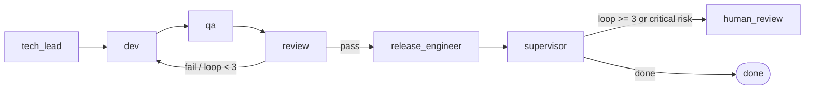

# Architecture

## Overview

Lean Omega is built around three concepts:

1. **Goal** — a declarative YAML file describing what software to build.
2. **State machine** — a LangGraph graph where each node is an autonomous agent.
3. **Sandboxed tools** — quality gates executed inside Docker, never on the host.

---

## Agent graph



### Node responsibilities

| Node | Responsibility |
|------|----------------|
| `tech_lead` | Decomposes the goal into `requirements[]`. Sets `risk_level = "critical"` when keywords indicate high-risk scope. |
| `dev` | Generates implementation files (`src/req_NNN_impl.py`) and test files for each requirement. Writes them via `workspace.write_file`. |
| `qa` | Runs the tool suite (ruff, pytest, mypy, bandit, pip-audit) inside the Docker sandbox. Populates `gate_evidence[]`. |
| `review` | Evaluates `gate_evidence`. Sets `current_phase = "done"` on pass or `"dev"` on failure. This is the only node that changes `current_phase`. |
| `release_engineer` | Records final artefact metadata in state. No file system writes. |
| `supervisor` | Enforces the loop cap (`loop_count >= 3`) and risk escalation. Routes to `human_review` or `done`. |

---

## State machine — `SDLCState`

All agents share a single Pydantic model passed through the graph:

```python
class SDLCState(BaseModel):
    goal_id: str
    objective: str
    requirements: list[str]          # populated by tech_lead
    current_phase: str               # controlled by review node
    loop_count: int
    risk_level: str                  # "low" | "medium" | "high" | "critical"
    file_changes: list[FileChange]   # every write_file call is logged here
    gate_evidence: list[ToolEvidence]
    ...
```

State is persisted to `runs/<run_id>/state.json` after every node execution. This enables **resume** (`--resume`) if the process is interrupted.

---

## Routing invariants

These rules are frozen and must survive all future stage refactors:

- `review_node` sets `state.current_phase` **authoritatively** — the router only reads this field; it never re-evaluates `gate_evidence`.
- `supervisor_node` escalates when `loop_count >= 3` **or** `risk_level == "critical"`.
- Optional tools (e.g. mypy) log evidence but cannot trigger a dev loop on their own — only `required=True` tools gate the pass/fail decision.

---

## Workspace layout

Each run produces a self-contained workspace under `volumes/<run_id>/`:

```
volumes/<run_id>/
├── requirements.txt       ← generated by dev node
├── src/
│   ├── req_001_impl.py
│   ├── req_002_impl.py
│   └── ...
├── tests/
│   ├── test_req_001.py
│   └── ...
└── .deps/                 ← pip install cache (Docker-owned, auto-managed)
```

All file writes are tracked in `state.file_changes` with a SHA-256 hash, requirement ID, and rationale for every change.

---

## Docker sandbox

The sandbox manager (`src/sandbox/manager.py`) wraps the Docker Python SDK. For every tool invocation:

1. A container is created from `omega-python-runner` with the volume bind-mounted.
2. The tool command runs inside the container.
3. stdout/stderr are captured and returned as `ToolEvidence`.
4. The container is removed immediately after exit.

The orchestrator process never calls `subprocess` on tool executables directly — all execution is delegated to the sandbox.

To run without the sandbox (local dev / CI environments without Docker):

```bash
python main.py --goal ... --no-sandbox
```

---

## LLM backend

The `BaseLLM` protocol (`src/core/llm.py`) is satisfied by two implementations:

| Class | Used when |
|-------|-----------|
| `LiteLLMBackend` | Default — calls any LiteLLM-compatible provider |
| `StubLLM` | Tests — deterministic, no network calls |

The active backend is selected by `load_llm()` based on `config/llm.yaml` and the `DEEPSEEK_API_KEY` (or equivalent) environment variable.
